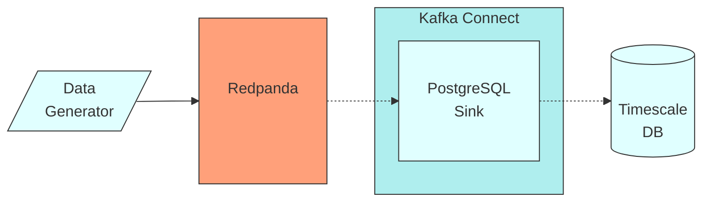

## Redpanda and TimescaleDB

The purpose of this tutorial is to show you an example architecture to integrate Redpanda with TimescaleDB. The tutorial provides step-by-step instructions for building a time-series data stream with Redpanda and TimescaleDB.

In this tutorial you will first stream time series data into Redpanda. Then you will create a Kafka Connect instance to sink the streaming data into the TimescaleDB. The Kafka Connect will use the Camel PostgreSQL Sink Connector. In the end you will have streaming data ingested into TimescaleDB. Therefore you can experiment with the analysis functionalities that TimescaleDB provides. The data flow is summarized in the following diagram.



To create a `redpanda-timeseries` network:

```bash
docker network create -d bridge redpanda-timeseries 
```

To run Redpanda:

```bash
docker run -d --name=redpanda --rm \
    --network redpanda-timeseries \
    -p 9092:9092 \
    -p 9644:9644 \
    docker.vectorized.io/vectorized/redpanda:latest \
    redpanda start \
    --advertise-kafka-addr redpanda \
    --overprovisioned \
    --smp 1  \
    --memory 1G \
    --reserve-memory 500M \
    --node-id 0 \
    --check=false
```

Produce into the topic:

```bash
docker pull nandercc/random-data-generator:v0.0.1

docker run --name data-generator --rm \
   --network redpanda-timeseries \
   nandercc/random-data-generator \
   data-producer payouts
```

To run TimescaleDB:

```bash
docker run -d --name timescaledb --rm \
  --network redpanda-timeseries \
  -v ./tools/timescaledb/:/docker-entrypoint-initdb.d/ \
  -p 5432:5432 \
  -e POSTGRES_PASSWORD=pass1234 \
  -e POSTGRES_USER=timescaledb \
  timescale/timescaledb-ha:pg14-latest
```

To build and run Kafka Connect:

```bash
docker build -t kafka_connect -f ./tools/kafka_connect/Dockerfile
docker run -d --name kafka_connect --rm \
  --network redpanda-timeseries \
  kafka_connect:latest
```

See data in TimescaleDB:

```bash
docker exec -it timescaledb psql -h localhost -d timescaledb -U timescaledb
```

Some example queries:

```sql
SELECT * FROM mock_data.peer_payouts
WHERE currency_code = 'EUR' AND payment_timestamp >= NOW() - INTERVAL '5 seconds'
ORDER BY payment_timestamp;
```

To create a materialized view:

```sql
CREATE MATERIALIZED VIEW mock_data.peer_payouts_per_minute
	WITH (timescaledb.continuous) AS
SELECT
	time_bucket('5 minute', payment_timestamp) AS day,
	status,
	AVG(amount)                                AS mean_amount,
	STDDEV(amount)                             AS std_amount,
	MAX(amount)                                AS max_amount,
	COUNT(1)                                   AS frequency
FROM mock_data.peer_payouts pyt
WHERE status = 'fail'
GROUP BY day, status;
```

With a time-series data stream from Redpanda to TimescaleDB, you can create actionable real-time applications in finance, IOT, or social media systems. Redpanda is compatible with Apache Kafka API, and TimescaleDB is PostgreSQL. Therefore a good variety of programmatic or non-programmatic connection options are already available for use. This makes it easier to start using those technologies.
